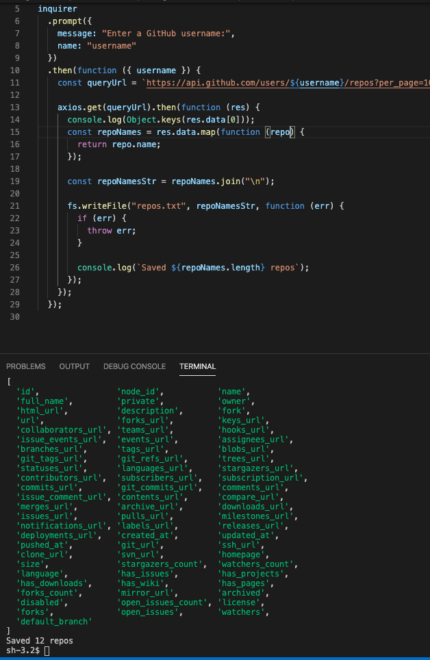

# profilegenerator
# live site here: https://marksirany.github.io/profilegenerator/

# What I was able to do:
1. make an axios request
2. console.log data
3. write data to a file
4. file was created and saved

# What I couldn't figure out:
I couldn't figure out how to grab all the data pieces that were listed in the hw instructions. I could only grab the user repo names and the number of repos.
